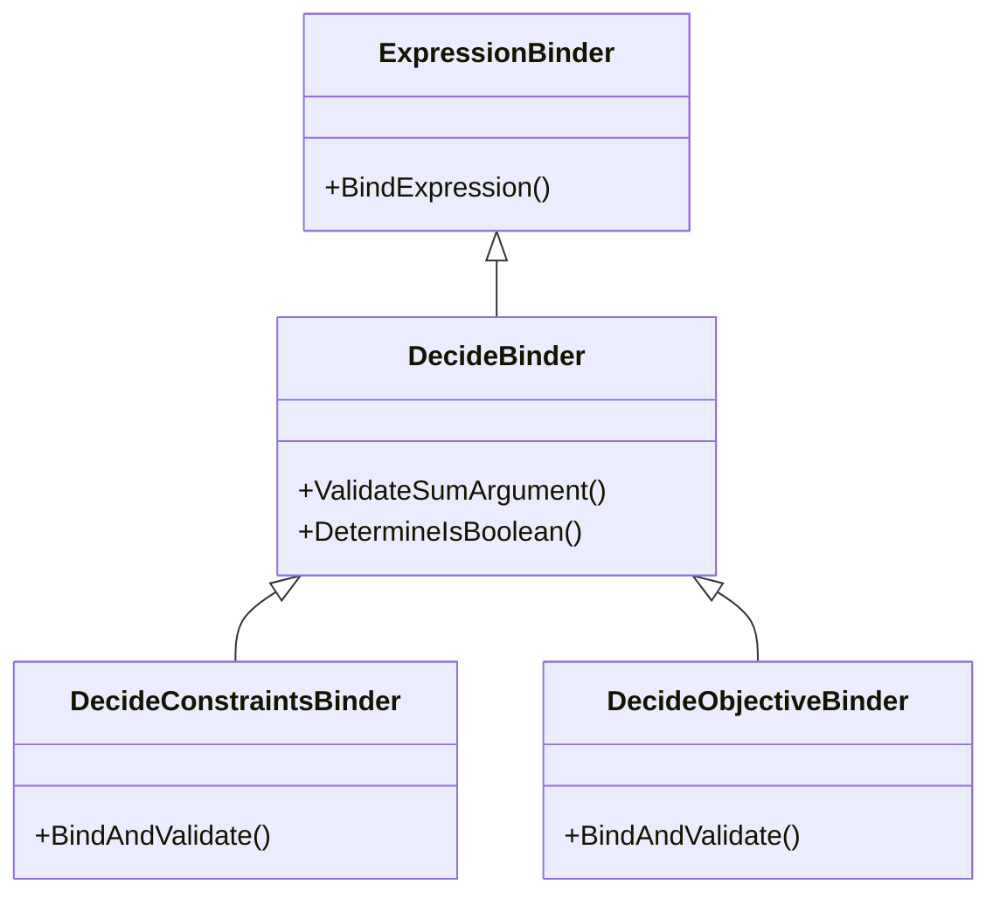
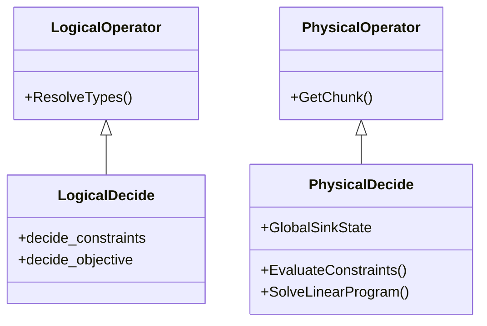

# Codebase Structure

This document provides a detailed map of the PackDB implementation within the DuckDB source tree. It is intended to help developers (and LLMs) understand the physical organization of the code and the relationships between key classes.

## 1. File Organization

The PackDB extension is integrated across several layers of the DuckDB engine.

### 1.1 Include Headers (`src/include/duckdb/`)

- **Common Enums**:
  - `common/enums/decide.hpp`: Defines `DecideSense` (MAX/MIN), `DecideExpressionType`, and other shared enums.
- **Binder API**:
  - `planner/expression_binder/decide_binder.hpp`: Base class for decision binders.
  - `planner/expression_binder/decide_constraints_binder.hpp`: Specialized binder for `SUCH THAT`.
  - `planner/expression_binder/decide_objective_binder.hpp`: Specialized binder for `MAXIMIZE/MINIMIZE`.
- **Logical Operators**:
  - `planner/operator/logical_decide.hpp`: Definition of the `LogicalDecide` node.
- **Physical Operators**:
  - `execution/operator/decide/physical_decide.hpp`: Definition of the `PhysicalDecide` node.
- **Symbolic Layer**:
  - `packdb/symbolic/decide_symbolic.hpp`: Interface to SymbolicC++.

### 1.2 Source Implementation (`src/`)

- **Symbolic Logic**:
  - `packdb/symbolic/decide_symbolic.cpp`: Implements normalization and symbolic translation.
- **Binder Logic**:
  - `planner/expression_binder/decide_binder.cpp`
  - `planner/expression_binder/decide_constraints_binder.cpp`
  - `planner/expression_binder/decide_objective_binder.cpp`
- **Planner Logic**:
  - `planner/operator/logical_decide.cpp`: Implementation of logical operator methods (serialization, etc.).
  - `execution/physical_plan/plan_decide.cpp`: Code to transform `LogicalDecide` $\rightarrow$ `PhysicalDecide`.
- **Execution Logic**:
  - `execution/operator/decide/physical_decide.cpp`: The core execution engine and HiGHS integration.

## 2. Class Hierarchy

### 2.1 Binder Inheritance

The binder classes inherit from DuckDB's standard `ExpressionBinder` to leverage existing expression validation (e.g., checking if columns exist) while adding custom rules for linearity.

### 2.2 Operator Hierarchy

Detailed view of how the new operators fit into the query plan.

## 3. Key Methods & Responsibilities

### `src/packdb/symbolic/decide_symbolic.cpp`

- **`ToSymbolicRecursive(ParsedExpression)`**: Walks a DuckDB AST and converts it to a `Symbolic` object.
- **`NormalizeConstraints(Symbolic)`**: Rearranges terms to isolate decision variables on LHS.

### `src/planner/expression_binder/decide_binder.cpp`

- **`ValidateSumArgument`**: Recursively checks that an expression is a linear combination of decision variables. Throws "Non-linear term detected" error.

### `src/execution/operator/decide/physical_decide.cpp`

- **`Sink(GlobalSinkState, LocalSinkState, DataChunk)`**: Materializes input rows into the `DecideGlobalSinkState`.
- **`Finalize(GlobalSinkState)`**: The main driver. Calls `AnalyzeConstraints`, `EvaluateConstraints`, constructs the HiGHS model, solves it, and stores the solution map.
- **`GetData(ExecutionContext, DataChunk)`**: Streaming output. Re-scans the materialized data, joins with the solution map, and emits results.
