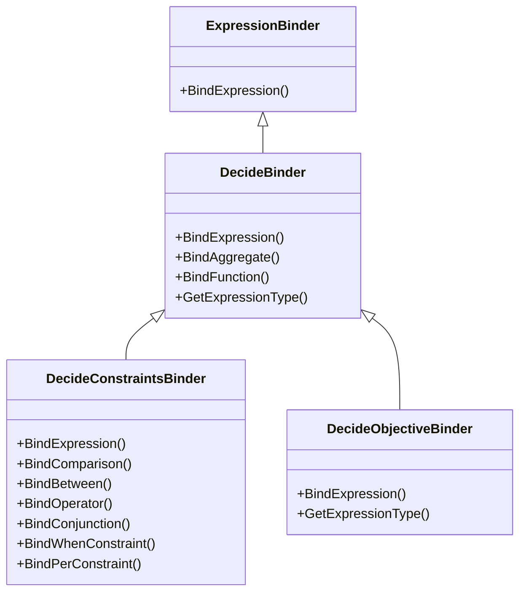
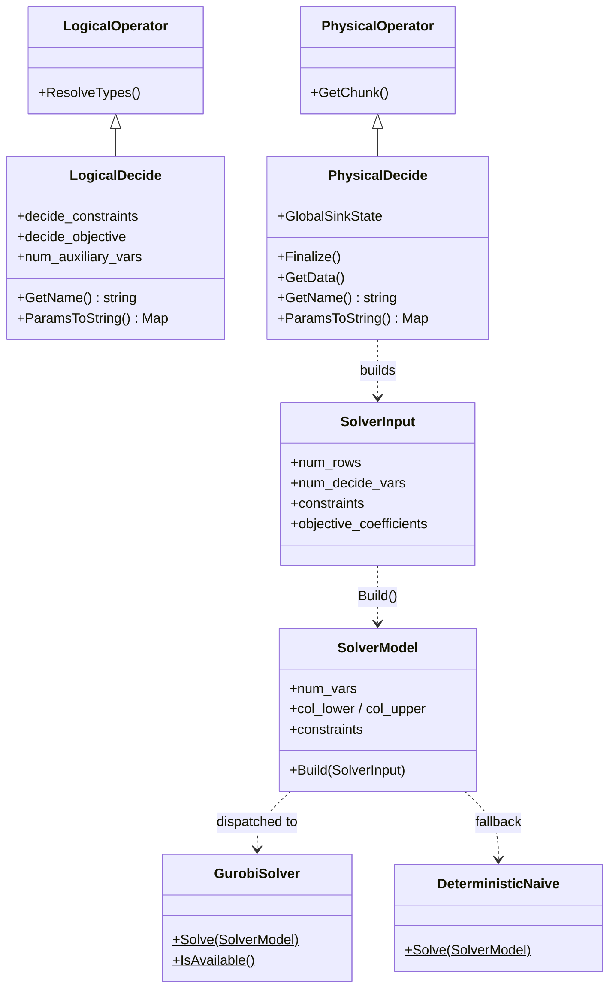

# Codebase Structure

This document provides a detailed map of the PackDB implementation within the DuckDB source tree. It is intended to help developers (and LLMs) understand the physical organization of the code and the relationships between key classes.

## 1. File Organization

The PackDB extension is integrated across several layers of the DuckDB engine.

### 1.1 Include Headers (`src/include/duckdb/`)
-   **Common Enums**:
    -   `common/enums/decide.hpp`: Defines `DecideSense` (MAX/MIN), `DecideExpression`, and other shared enums.
-   **Binder API**:
    -   `planner/expression_binder/decide_binder.hpp`: Base class for decision binders.
    -   `planner/expression_binder/decide_constraints_binder.hpp`: Specialized binder for `SUCH THAT`.
    -   `planner/expression_binder/decide_objective_binder.hpp`: Specialized binder for `MAXIMIZE/MINIMIZE`.
-   **Logical Operators**:
    -   `planner/operator/logical_decide.hpp`: Definition of the `LogicalDecide` node.
-   **Physical Operators**:
    -   `execution/operator/decide/physical_decide.hpp`: Definition of the `PhysicalDecide` node.
-   **Symbolic Layer**:
    -   `packdb/symbolic/decide_symbolic.hpp`: Interface to SymbolicC++.
-   **Solver & Model Headers**:
    -   `packdb/solver_input.hpp`: `SolverInput`, `EvaluatedConstraint` structs — bridge between execution and solver.
    -   `packdb/ilp_model.hpp`: `SolverModel` struct — solver-agnostic model representation. Linear constraints are stored row-wise in CSR (`row_start` / `col_index` / `value` / `sense` / `rhs`) so HiGHS ingests them directly and Gurobi can use `GRBaddconstrs`.
    -   `packdb/ilp_solver.hpp`: `SolveModel()` facade declaration.
    -   `packdb/gurobi/gurobi_solver.hpp`: `GurobiSolver` class declaration.
    -   `packdb/naive/deterministic_naive.hpp`: `DeterministicNaive` class declaration.

### 1.2 Source Implementation (`src/`)
-   **Symbolic Logic**:
    -   `packdb/symbolic/decide_symbolic.cpp`: Implements normalization and symbolic translation.
-   **Binder Logic**:
    -   `planner/expression_binder/decide_binder.cpp`
    -   `planner/expression_binder/decide_constraints_binder.cpp`
    -   `planner/expression_binder/decide_objective_binder.cpp`
-   **Planner Logic**:
    -   `planner/operator/logical_decide.cpp`: Implementation of logical operator methods (serialization, etc.).
    -   `execution/physical_plan/plan_decide.cpp`: Code to transform `LogicalDecide` $\rightarrow$ `PhysicalDecide`.
-   **Execution Logic**:
    -   `execution/operator/decide/physical_decide.cpp`: The core execution engine and HiGHS integration.
-   **Solver & Model Layer**:
    -   `packdb/utility/ilp_model_builder.cpp`: Transforms `SolverInput` → `SolverModel` (variable setup, constraint building, sanity checks).
    -   `packdb/utility/ilp_solver.cpp`: Solver facade — inspects `SolverInput` for required capabilities (quadratic constraints, non-convex objective, MIQP), picks Gurobi vs. HiGHS, rejects HiGHS-incompatible models *before* `SolverModel::Build()` to avoid wasted Q/QC assembly, then dispatches.
    -   `packdb/gurobi/gurobi_solver.cpp`: Gurobi backend using C API, single bulk `GRBaddconstrs` from CSR (per-row fallback when symbol absent).
    -   `packdb/naive/deterministic_naive.cpp`: HiGHS backend using C++ API, ingests `SolverModel` CSR directly into `HighsLp::a_matrix_`.

## 2. Class Hierarchy

### 2.1 Binder Inheritance
The binder classes inherit from DuckDB's standard `ExpressionBinder` to leverage existing expression validation (e.g., checking if columns exist) while adding custom rules for linearity.

Note: `ValidateSumArgument()` is a free function declared in `decide_binder.hpp`, not a method on any class. It validates that an expression is a linear (or optionally quadratic) combination of decision variables.

### 2.2 Operator Hierarchy
Detailed view of how the new operators fit into the query plan.

## 3. Key Methods & Responsibilities

### `src/packdb/symbolic/decide_symbolic.cpp`
-   **`ToSymbolicRecursive(ParsedExpression)`**: Walks a DuckDB AST and converts it to a `Symbolic` object.
-   **`NormalizeDecideConstraints(ParsedExpression)`**: Rearranges terms to isolate decision variables on LHS. Takes and returns a `ParsedExpression` (calls `NormalizeConstraintsRecursive` internally).
-   **`NormalizeDecideObjective(ParsedExpression)`**: Same normalization for the objective expression.

### `src/planner/expression_binder/decide_binder.cpp`
-   **`ValidateSumArgument()`** (free function): Recursively checks that an expression is a linear combination of decision variables (or optionally quadratic when `allow_quadratic` is true). Throws "Non-linear term detected" error. Called by both `DecideConstraintsBinder` and `DecideObjectiveBinder`.

### `src/execution/operator/decide/physical_decide.cpp`
-   **`Sink(GlobalSinkState, LocalSinkState, DataChunk)`**: Materializes input rows into the `DecideGlobalSinkState`.
-   **`Finalize(GlobalSinkState)`**: The main driver. Evaluates constraint coefficients row-by-row, builds expression-level WHEN+PER group mappings and aggregate-local filter masks, constructs `SolverInput`, calls `SolveModel()`, and stores the solution vector.
-   **`GetData(ExecutionContext, DataChunk)`**: Streaming output. Re-scans the materialized data, projects solution values with type-specific casting (BOOLEAN/INTEGER/DOUBLE rounding), and filters out auxiliary variables.

### EXPLAIN Support (Logical & Physical)
-   **`LogicalDecide::GetName()`** / **`PhysicalDecide::GetName()`**: Return `"DECIDE"` for the plan renderer.
-   **`LogicalDecide::ParamsToString()`** / **`PhysicalDecide::ParamsToString()`**: Build an `InsertionOrderPreservingMap` with `Variables`, `Objective`, and `Constraints` entries. Constraints are extracted by recursively splitting the AND-tree via `CollectConstraintStrings`, unwrapping WHEN/PER wrappers into display suffixes.

### `src/packdb/utility/ilp_model_builder.cpp`
-   **`SolverModel::Build(SolverInput &input, const VarIndexer &indexer)`**: Static factory that transforms evaluated constraints into a flat ILP model. Handles 3 constraint paths (aggregate ungrouped, aggregate grouped, per-row). AVG scaling is applied during coefficient evaluation before `SolverInput` reaches the model builder. Takes `SolverInput` by non-const reference so raw global constraints can be moved (not copied) into `SolverModel`. The `VarIndexer` is built once in `PhysicalDecide::Finalize()` and threaded in.
-   **`SparseCoeffAccumulator`** (declared in `ilp_model.hpp`): Reusable scratch storage used by aggregate-constraint accumulation paths in both `ilp_model_builder.cpp` and `physical_decide.cpp`. Two strategies — dense (`vector<double>` indexed by flat var idx + `touched` list) when the decide-variable index span fits a memory cap, sorted/merged `(idx, coeff)` pairs otherwise.

### `src/packdb/utility/ilp_solver.cpp`
-   **`SolveModel(SolverInput &input, const VarIndexer &indexer)`**: Facade that builds the SolverModel and dispatches to GurobiSolver (if available) or DeterministicNaive (HiGHS fallback). Receives the `VarIndexer` from the caller (built once in finalization) instead of constructing one internally.

### `src/packdb/gurobi/gurobi_solver.cpp`
-   **`GurobiSolver::IsAvailable()`**: One-time lazy check for Gurobi license.
-   **`GurobiSolver::Solve(const SolverModel &)`**: Builds Gurobi model via C API, solves, returns solution vector.

### `src/packdb/naive/deterministic_naive.cpp`
-   **`DeterministicNaive::Solve(const SolverModel &)`**: Converts SolverModel to HiGHS format (COO→CSR), solves, returns solution vector.

## 4. Table-Scoped Variable Support

### Key Structs

-   **`EntityScopeInfo`** (`src/include/duckdb/planner/operator/logical_decide.hpp`): Carries table-scoped variable metadata through the plan. Contains `table_alias`, `source_table_index`, `entity_key_bindings` (logical column bindings), `entity_key_physical_indices` (physical chunk positions, resolved during plan creation in `plan_decide.cpp`), and `scoped_variable_indices`.
-   **`EntityMapping`** (`src/include/duckdb/packdb/solver_input.hpp`): Execution-time mapping from rows to entity IDs. Contains `num_entities` and `row_to_entity` vector. Built during Phase 1.5 in `physical_decide.cpp`.
-   **`VarIndexer`** (struct, `src/include/duckdb/packdb/ilp_model.hpp`): Computes and encapsulates the three-block variable layout (row-scoped, entity-scoped, global auxiliary). Provides `Get(var_idx, row)` for index lookup and `NumInstances(var_idx)` for instance count. Built once via `Build()` (owning) in `PhysicalDecide::Finalize()` and threaded through `SolveModel()` / `SolverModel::Build()`, then moved onto `gstate.var_indexer` for readback in `GetData`. `BuildRef()` (non-owning) is retained but currently unused in production code.

### Key Code Paths

-   **Grammar**: `third_party/libpg_query/grammar/statements/select.y` — `ColId '.' ColId IS variable_type` rule for qualified variable declarations.
-   **Binder**: `src/planner/binder/query_node/bind_select_node.cpp` — resolves table alias, creates `EntityScopeInfo`, stores on `BoundSelectNode`.
-   **Plan creation**: `src/execution/physical_plan/plan_decide.cpp` — transfers `EntityScopeInfo` to `LogicalDecide` / `PhysicalDecide`, resolves logical column bindings to physical chunk indices via `op.children[0]->GetColumnBindings()`.
-   **Optimizer**: `src/optimizer/decide/decide_optimizer.cpp` — auxiliary variables receive `INVALID_INDEX` scope (row-scoped); entity scope propagated via `variable_entity_scope` vector.
-   **Execution (Phase 1.5)**: `src/execution/operator/decide/physical_decide.cpp` — evaluates entity key columns, builds `EntityMapping` using `unordered_map<string, idx_t>` with NULL-safe composite key tagging.
-   **Model building**: `src/packdb/utility/ilp_model_builder.cpp` — `VarIndexer::Build()` computes three-block layout; aggregate constraint coefficients accumulated via `SparseCoeffAccumulator` (dense + touched-list, or sorted-pairs fallback) for entity-scoped variables.
-   **Readback**: `src/execution/operator/decide/physical_decide.cpp` (`GetData`) — uses `gstate.var_indexer.Get(var_idx, row)` for all variable types.
