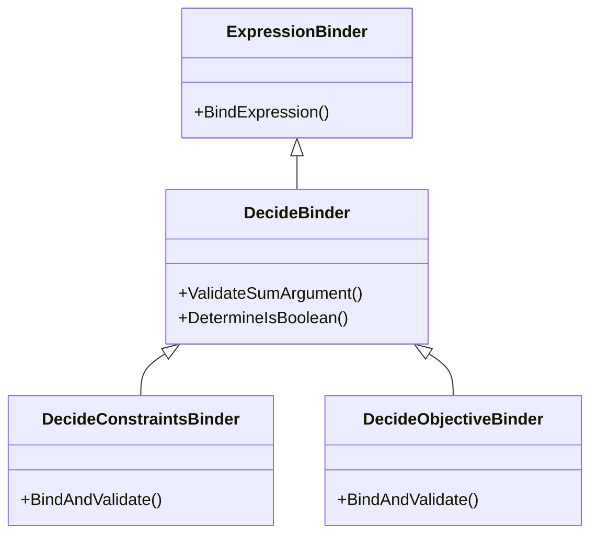
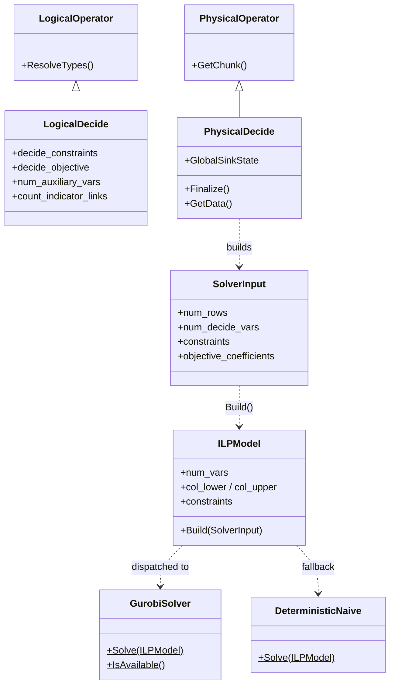

# Codebase Structure

This document provides a detailed map of the PackDB implementation within the DuckDB source tree. It is intended to help developers (and LLMs) understand the physical organization of the code and the relationships between key classes.

## 1. File Organization

The PackDB extension is integrated across several layers of the DuckDB engine.

### 1.1 Include Headers (`src/include/duckdb/`)
-   **Common Enums**:
    -   `common/enums/decide.hpp`: Defines `DecideSense` (MAX/MIN), `DecideExpressionType`, and other shared enums.
-   **Binder API**:
    -   `planner/expression_binder/decide_binder.hpp`: Base class for decision binders.
    -   `planner/expression_binder/decide_constraints_binder.hpp`: Specialized binder for `SUCH THAT`.
    -   `planner/expression_binder/decide_objective_binder.hpp`: Specialized binder for `MAXIMIZE/MINIMIZE`.
-   **Logical Operators**:
    -   `planner/operator/logical_decide.hpp`: Definition of the `LogicalDecide` node.
-   **Physical Operators**:
    -   `execution/operator/decide/physical_decide.hpp`: Definition of the `PhysicalDecide` node.
-   **Symbolic Layer**:
    -   `packdb/symbolic/decide_symbolic.hpp`: Interface to SymbolicC++.
-   **Solver & Model Headers**:
    -   `packdb/solver_input.hpp`: `SolverInput`, `EvaluatedConstraint` structs — bridge between execution and solver.
    -   `packdb/ilp_model.hpp`: `ILPModel`, `ILPConstraint` structs — solver-agnostic model representation.
    -   `packdb/ilp_solver.hpp`: `SolveILP()` facade declaration.
    -   `packdb/gurobi/gurobi_solver.hpp`: `GurobiSolver` class declaration.
    -   `packdb/naive/deterministic_naive.hpp`: `DeterministicNaive` class declaration.

### 1.2 Source Implementation (`src/`)
-   **Symbolic Logic**:
    -   `packdb/symbolic/decide_symbolic.cpp`: Implements normalization and symbolic translation.
-   **Binder Logic**:
    -   `planner/expression_binder/decide_binder.cpp`
    -   `planner/expression_binder/decide_constraints_binder.cpp`
    -   `planner/expression_binder/decide_objective_binder.cpp`
-   **Planner Logic**:
    -   `planner/operator/logical_decide.cpp`: Implementation of logical operator methods (serialization, etc.).
    -   `execution/physical_plan/plan_decide.cpp`: Code to transform `LogicalDecide` $\rightarrow$ `PhysicalDecide`.
-   **Execution Logic**:
    -   `execution/operator/decide/physical_decide.cpp`: The core execution engine and HiGHS integration.
-   **Solver & Model Layer**:
    -   `packdb/utility/ilp_model_builder.cpp`: Transforms `SolverInput` → `ILPModel` (variable setup, constraint building, sanity checks).
    -   `packdb/utility/ilp_solver.cpp`: Solver facade — dispatches to Gurobi or HiGHS.
    -   `packdb/gurobi/gurobi_solver.cpp`: Gurobi backend using C API, COO format constraints.
    -   `packdb/naive/deterministic_naive.cpp`: HiGHS backend using C++ API, COO→CSR conversion.

## 2. Class Hierarchy

### 2.1 Binder Inheritance
The binder classes inherit from DuckDB's standard `ExpressionBinder` to leverage existing expression validation (e.g., checking if columns exist) while adding custom rules for linearity.

### 2.2 Operator Hierarchy
Detailed view of how the new operators fit into the query plan.

## 3. Key Methods & Responsibilities

### `src/packdb/symbolic/decide_symbolic.cpp`
-   **`ToSymbolicRecursive(ParsedExpression)`**: Walks a DuckDB AST and converts it to a `Symbolic` object.
-   **`NormalizeConstraints(Symbolic)`**: Rearranges terms to isolate decision variables on LHS.

### `src/planner/expression_binder/decide_binder.cpp`
-   **`ValidateSumArgument`**: Recursively checks that an expression is a linear combination of decision variables. Throws "Non-linear term detected" error.

### `src/execution/operator/decide/physical_decide.cpp`
-   **`Sink(GlobalSinkState, LocalSinkState, DataChunk)`**: Materializes input rows into the `DecideGlobalSinkState`.
-   **`Finalize(GlobalSinkState)`**: The main driver. Evaluates constraint coefficients row-by-row, builds WHEN+PER group mappings, generates Big-M linking constraints for COUNT indicators, constructs `SolverInput`, calls `SolveILP()`, and stores the solution vector.
-   **`GetData(ExecutionContext, DataChunk)`**: Streaming output. Re-scans the materialized data, projects solution values with type-specific casting (BOOLEAN/INTEGER/DOUBLE rounding), and filters out auxiliary variables.

### `src/packdb/utility/ilp_model_builder.cpp`
-   **`ILPModel::Build(const SolverInput &input)`**: Static factory that transforms evaluated constraints into a flat ILP model. Handles 3 constraint paths (aggregate ungrouped, aggregate grouped, per-row) and applies AVG→SUM RHS scaling.

### `src/packdb/utility/ilp_solver.cpp`
-   **`SolveILP(const SolverInput &input)`**: Facade that builds the ILPModel and dispatches to GurobiSolver (if available) or DeterministicNaive (HiGHS fallback).

### `src/packdb/gurobi/gurobi_solver.cpp`
-   **`GurobiSolver::IsAvailable()`**: One-time lazy check for Gurobi license.
-   **`GurobiSolver::Solve(const ILPModel &)`**: Builds Gurobi model via C API, solves, returns solution vector.

### `src/packdb/naive/deterministic_naive.cpp`
-   **`DeterministicNaive::Solve(const ILPModel &)`**: Converts ILPModel to HiGHS format (COO→CSR), solves, returns solution vector.
