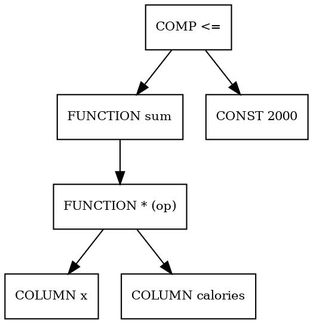

# PackDB: Symbolic Translation & Normalization - Complete Implementation Guide

This document provides **comprehensive technical documentation** for PackDB's symbolic translation layer, which enables complex algebraic expressions in `DECIDE`, `SUCH THAT`, and `MAXIMIZE/MINIMIZE` clauses.

---

## 📚 Table of Contents

1. [Architecture Overview](#architecture-overview)
2. [External Dependencies](#external-dependencies)
3. [Core Data Structures](#core-data-structures)
4. [Helper Functions](#helper-functions)
5. [Conversion Functions](#conversion-functions)
6. [Normalization Functions](#normalization-functions)
7. [Utility Functions](#utility-functions)
8. [Algorithm Deep Dive](#algorithm-deep-dive)
9. [Testing Strategy](#testing-strategy)

---

## 🏛️ Architecture Overview

### The Normalization Strategy

The core architectural pattern is **symbolic normalization**, which acts as a preprocessing layer:

```
User Expression → Parse → ToSymbolic() → Simplify → FromSymbolic() → Canonical Form → Binder
```

**Key Principles:**

1. **Separation of Concerns**: The symbolic layer is isolated from binding logic.
2. **Round-Trip Conversion**: Expressions can be converted to symbolic form and back.
3. **Algebraic Simplification**: Uses SymbolicC++ to perform symbolic algebra (expand, simplify, factor).
4. **Canonical Forms**: Produces predictable output shapes that downstream binders expect.

---

## 🔗 External Dependencies

### SymbolicC++ Library

**What it is:** A C++ library for symbolic mathematics, similar to SymPy (Python) or Mathematica.

**Location:** Included via `#include "symbolicc++.h"`

**Key Classes Used:**

| Class | Purpose | Example |
|-------|---------|---------|
| `Symbolic` | Base class representing any symbolic expression | `Symbolic s = x + 2*y` |
| `Symbol` | Named variable | `Symbolic x("x")` |
| `Numeric` | Numeric constant | `Symbolic(42.0)` |
| `Sum` | Sum of symbolic terms | `x + y + z` |
| `Product` | Product of symbolic factors | `x * y * 2.0` |

**Operations Supported:**

```cpp
Symbolic x("x"), y("y");
auto sum = x + y;           // Creates Sum
auto product = x * y;       // Creates Product
auto simplified = (x+x).simplify();  // Returns 2*x
auto expanded = ((x+1)*(y+2)).expand();  // Returns x*y + 2*x + y + 2
```

**Type Inspection:**

```cpp
if (s.type() == typeid(Numeric)) {
    double val = double(s);  // Extract numeric value
}
if (s.type() == typeid(Symbol)) {
    CastPtr<const Symbol>(s)->name;  // Get variable name
}
```

---

## 📦 Core Data Structures

### SymbolicTranslationContext

**Purpose:** Carries contextual information needed during translation.

```cpp
struct SymbolicTranslationContext {
    const case_insensitive_map_t<idx_t> &decide_variables;
    
    explicit SymbolicTranslationContext(const case_insensitive_map_t<idx_t> &vars);
};
```

**Fields:**

- **`decide_variables`**: Map of DECIDE variable names → their indices
  - Example: `{"x": 0, "y": 1, "z": 2}`
  - Used to distinguish DECIDE variables from row-varying columns

**Usage Pattern:**

```cpp
case_insensitive_map_t<idx_t> vars;
vars["x"] = 0; vars["y"] = 1;
SymbolicTranslationContext ctx(vars);
auto symbolic = ToSymbolicObj(*expr, ctx);
```

---

## 🛠️ Helper Functions

### IsDecideVariable()

**Signature:**

```cpp
bool IsDecideVariable(const ParsedExpression &expr, 
                      const case_insensitive_map_t<idx_t> &variables);
```

**Purpose:** Determines if an expression is a DECIDE variable.

**Algorithm:**

1. **Check Expression Type**: Must be `ExpressionClass::COLUMN_REF`
2. **Check Qualification**: Must NOT be qualified (e.g., `table.column` → false)
3. **Check Variable Map**: Column name must exist in `variables` map

**Input:**
- `expr`: Expression to check
- `variables`: Map of known DECIDE variable names

**Output:**
- `true` if `expr` is an unqualified column reference in the DECIDE variables map
- `false` otherwise

**Example:**

```cpp
// Given: variables = {"x": 0, "y": 1}
IsDecideVariable(ColumnRef("x"), variables)        → true
IsDecideVariable(ColumnRef("calories"), variables) → false  (not in map)
IsDecideVariable(ColumnRef("t.x"), variables)      → false  (qualified)
IsDecideVariable(ConstantExpr(42), variables)      → false  (not a column)
```

**Debug Output:**

```
IsDecideVariable: Checking expression: x
  -> Column name: x Is DECIDE variable: true
```

---

### IsRowVarying()

**Signature:**

```cpp
bool IsRowVarying(const ParsedExpression &expr, 
                  const case_insensitive_map_t<idx_t> &decide_variables);
```

**Purpose:** Determines if an expression contains row-varying columns (i.e., table columns that are NOT DECIDE variables).

**Algorithm:**

1. **Traverse Expression Tree**: Uses `ParsedExpressionIterator::EnumerateChildren()`
2. **Check Each Column**: For every column reference found:
   - If it's NOT a DECIDE variable → mark as row-varying
3. **Return Result**: True if any row-varying columns found

**Input:**
- `expr`: Expression to analyze
- `decide_variables`: Map of DECIDE variable names

**Output:**
- `true` if expression contains any column reference NOT in `decide_variables`
- `false` if expression only contains DECIDE variables, constants, or operators

**Example:**

```cpp
// Given: decide_variables = {"x": 0, "y": 1}
IsRowVarying(ColumnRef("calories"), decide_variables)  → true
IsRowVarying(ColumnRef("x"), decide_variables)         → false
IsRowVarying(x + calories, decide_variables)           → true  (contains calories)
IsRowVarying(x + y + 5, decide_variables)              → false (only DECIDE vars)
```

**Use Case:** Distinguishing between:
- **DECIDE variables**: Optimization decision variables (e.g., `x`, `y`)
- **Row-varying columns**: Data from input tables (e.g., `calories`, `price`)

---

## 🔄 Conversion Functions

### ToSymbolicRecursive() / ToSymbolicObj()

**Signature:**

```cpp
Symbolic ToSymbolicRecursive(const ParsedExpression &expr, 
                             SymbolicTranslationContext &ctx);

Symbolic ToSymbolicObj(const ParsedExpression &expr, 
                       SymbolicTranslationContext &ctx);
```

**Purpose:** Converts DuckDB's `ParsedExpression` tree into a SymbolicC++ `Symbolic` object.

**Architecture:**
- `ToSymbolicObj()`: Public wrapper that calls the recursive implementation
- `ToSymbolicRecursive()`: Recursive tree-traversal function

**Algorithm:** Switch on expression class type and recursively convert children.

---

#### Handling: CONSTANT

**Input:** `ConstantExpression` (e.g., `42`, `3.14`, `'text'`)

**Process:**

1. Extract value type (`INTEGER`, `BIGINT`, `DOUBLE`, `FLOAT`, `VARCHAR`, etc.)
2. **Numeric types**: Cast to `double` and create `Symbolic(value)`
3. **String types**: Create `Symbolic(string_value)` as a symbol
4. **Decimal/HUGEINT**: Convert via `DefaultCastAs(DOUBLE)`

**Output:** `Symbolic` numeric constant or string symbol

**Code:**

```cpp
case ExpressionClass::CONSTANT:
    auto &const_expr = expr.Cast<ConstantExpression>();
    switch (const_expr.value.type().id()) {
        case LogicalTypeId::INTEGER:
            value = const_expr.value.GetValue<int32_t>();
            return Symbolic(value);
        case LogicalTypeId::VARCHAR:
            auto s = const_expr.value.GetValue<string>();
            return Symbolic(s.c_str());
        // ... other types
    }
```

**Example:**

```
42          → Symbolic(42.0)
3.14        → Symbolic(3.14)
'calories'  → Symbolic("calories")
```

---

#### Handling: COLUMN_REF

**Input:** `ColumnRefExpression` (e.g., `x`, `calories`, `table.column`)

**Process:**

1. Extract column name
2. Check if it's a DECIDE variable using `IsDecideVariable()`
3. Create `Symbolic` with the column name

**Output:** `Symbolic` symbol with the column name

**Code:**

```cpp
case ExpressionClass::COLUMN_REF:
    auto &colref = expr.Cast<ColumnRefExpression>();
    const auto &name = colref.GetColumnName();
    if (IsDecideVariable(expr, ctx.decide_variables)) {
        return Symbolic(name);  // DECIDE variable
    } else {
        return Symbolic(name);  // Row-varying column
    }
```

**Note:** Both cases currently return the same result (a symbol), but the distinction is logged for debugging.

**Example:**

```
x          → Symbolic("x")
calories   → Symbolic("calories")
```

---

#### Handling: OPERATOR

**Input:** `OperatorExpression` (e.g., `NOT x`, `x IN (1,2,3)`)

**Process:**

1. **NOT operator**: Convert child and wrap in string representation `"NOT(...)"`
2. **IN / NOT_IN operators**:
   - Convert left-hand side
   - Convert all right-hand side values
   - Build string representation `"IN(lhs,val1,val2,...)"`

**Output:** `Symbolic` with string representation of the operator

**Code:**

```cpp
case ExpressionClass::OPERATOR:
    if (op_expr.type == ExpressionType::OPERATOR_NOT) {
        auto child = ToSymbolicRecursive(*op_expr.children[0], ctx);
        return Symbolic("NOT(" + child.str() + ")");
    }
    if (op_expr.type == ExpressionType::COMPARE_IN) {
        // Build "IN(left,rhs1,rhs2,...)"
    }
```

**Example:**

```
NOT x              → Symbolic("NOT(x)")
x IN (1, 2, 3)     → Symbolic("IN(x,1,2,3)")
x NOT IN (5, 10)   → Symbolic("NOT_IN(x,5,10)")
```

**Note:** These are represented as symbolic strings, not algebraic operations.

---

#### Handling: CAST

**Input:** `CastExpression` (e.g., `CAST(x AS INTEGER)`)

**Process:**

1. Ignore the cast type
2. Recursively convert the child expression

**Output:** Symbolic representation of the child (cast is transparent)

**Code:**

```cpp
case ExpressionClass::CAST:
    auto &cast_expr = expr.Cast<CastExpression>();
    return ToSymbolicRecursive(*cast_expr.child, ctx);
```

**Rationale:** For symbolic algebra, type casts don't affect the mathematical structure.

**Example:**

```
CAST(x AS DOUBLE)  → Symbolic("x")
CAST(2+3 AS INT)   → Symbolic(5.0)
```

---

#### Handling: COMPARISON

**Input:** `ComparisonExpression` (e.g., `x < 5`, `a = b`, `y >= 10`)

**Process:**

1. Recursively convert left and right children
2. Map comparison type to a string tag:
   - `COMPARE_EQUAL` → `"EQ"`
   - `COMPARE_LESSTHAN` → `"LT"`
   - `COMPARE_LESSTHANOREQUALTO` → `"LE"`
   - `COMPARE_GREATERTHAN` → `"GT"`
   - `COMPARE_GREATERTHANOREQUALTO` → `"GE"`
   - `COMPARE_NOTEQUAL` → `"NE"`
3. Build string representation: `"TAG(left,right)"`

**Output:** `Symbolic` with string representation of the comparison

**Code:**

```cpp
case ExpressionClass::COMPARISON:
    auto left = ToSymbolicRecursive(*cmp.left, ctx);
    auto right = ToSymbolicRecursive(*cmp.right, ctx);
    string tag;
    switch (cmp.type) {
        case ExpressionType::COMPARE_EQUAL: tag = "EQ"; break;
        case ExpressionType::COMPARE_LESSTHAN: tag = "LT"; break;
        // ...
    }
    return Symbolic(tag + "(" + left.str() + "," + right.str() + ")");
```

**Example:**

```
x < 5              → Symbolic("LT(x,5)")
calories = 2000    → Symbolic("EQ(calories,2000)")
price >= budget    → Symbolic("GE(price,budget)")
```

**Note:** Comparisons are symbolic predicates, not algebraic expressions.

---

#### Handling: BETWEEN

**Input:** `BetweenExpression` (e.g., `x BETWEEN 1 AND 10`)

**Process:**

1. Convert input, lower, and upper expressions
2. Build string representation: `"BETWEEN(input,lower,upper)"`

**Output:** `Symbolic` with string representation

**Code:**

```cpp
case ExpressionClass::BETWEEN:
    auto input = ToSymbolicRecursive(*between.input, ctx);
    auto lower = ToSymbolicRecursive(*between.lower, ctx);
    auto upper = ToSymbolicRecursive(*between.upper, ctx);
    return Symbolic("BETWEEN(" + input.str() + "," + lower.str() + "," + upper.str() + ")");
```

**Example:**

```
x BETWEEN 1 AND 10  → Symbolic("BETWEEN(x,1,10)")
```

---

#### Handling: CONJUNCTION

**Input:** `ConjunctionExpression` (e.g., `a AND b`, `x OR y OR z`)

**Process:**

1. Determine tag: `AND` or `OR`
2. Recursively convert all children
3. Build string representation: `"TAG(child1,child2,...)"`

**Output:** `Symbolic` with string representation

**Code:**

```cpp
case ExpressionClass::CONJUNCTION:
    string tag = (conj.type == ExpressionType::CONJUNCTION_AND) ? "AND" : "OR";
    // Convert all children and concatenate
    return Symbolic(tag + "(" + children_str + ")");
```

**Example:**

```
x AND y            → Symbolic("AND(x,y)")
a OR b OR c        → Symbolic("OR(a,b,c)")
x > 5 AND y < 10   → Symbolic("AND(GT(x,5),LT(y,10))")
```

---

#### Handling: FUNCTION

**Input:** `FunctionExpression` (e.g., `2 + 3`, `x * y`, `SUM(x*calories)`)

**Process:**

**Case 1: Arithmetic Operators** (`is_operator = true`)

Recognized operators: `+`, `-`, `*`, `/`

1. Recursively convert all arguments
2. Apply SymbolicC++ algebraic operation:
   - `+` → `args[0] + args[1]`
   - `-` → `args[0] - args[1]` or `-args[0]` (unary)
   - `*` → `args[0] * args[1]`
   - `/` → `args[0] / args[1]`

**Output:** Algebraic `Symbolic` (Sum, Product, etc.)

**Code:**

```cpp
if (func_expr.is_operator) {
    if (func_expr.function_name == "+") {
        return args[0] + args[1];  // SymbolicC++ addition
    }
    if (func_expr.function_name == "*") {
        return args[0] * args[1];  // SymbolicC++ multiplication
    }
    // ...
}
```

**Example:**

```
2 + 3              → Symbolic(5.0)  [after simplification]
x + y              → Sum{x, y}
x * 2              → Product{x, 2.0}
x * calories       → Product{x, calories}
```

---

**Case 2: SUM() Function**

1. Convert the inner argument
2. Multiply by special marker: `Symbolic("__SUM__")`
3. Return product

**Output:** `Product{__SUM__, inner_expression}`

**Code:**

```cpp
if (func_name_lower == "sum") {
    auto inner_symbolic = ToSymbolicRecursive(*func_expr.children[0], ctx);
    return Symbolic("__SUM__") * inner_symbolic;
}
```

**Example:**

```
SUM(x)             → Product{__SUM__, x}
SUM(x * calories)  → Product{__SUM__, x, calories}
```

**Rationale:** The `__SUM__` marker allows FromSymbolic() to reconstruct the aggregate function later.

---

**Case 3: Unsupported Functions**

Any function not recognized throws `InternalException`.

**Example:**

```
SQRT(x)   → ❌ InternalException: Unsupported function: SQRT
```

---

### FromSymbolic()

**Signature:**

```cpp
unique_ptr<ParsedExpression> FromSymbolic(const Symbolic &s, 
                                          SymbolicTranslationContext &ctx);
```

**Purpose:** Converts a SymbolicC++ `Symbolic` object back into DuckDB's `ParsedExpression`.

**Algorithm:** Switch on the Symbolic type and recursively rebuild the expression tree.

---

#### Handling: Numeric

**Input:** `Numeric` type (e.g., `Symbolic(42.0)`)

**Process:**

1. Cast to `double`
2. Create `ConstantExpression` with `Value::DOUBLE()`

**Output:** `ConstantExpression` with DOUBLE value

**Code:**

```cpp
if (s.type() == typeid(Numeric)) {
    return make_uniq<ConstantExpression>(Value::DOUBLE(double(s)));
}
```

**Example:**

```
Symbolic(42.0)  → ConstantExpression(42.0)
Symbolic(3.14)  → ConstantExpression(3.14)
```

---

#### Handling: Symbol

**Input:** `Symbol` type (e.g., `Symbolic("x")`)

**Process:**

1. Extract symbol name
2. Create `ColumnRefExpression` with the name

**Output:** `ColumnRefExpression`

**Code:**

```cpp
if (s.type() == typeid(Symbol)) {
    auto name = CastPtr<const Symbol>(s)->name;
    return make_uniq<ColumnRefExpression>(name);
}
```

**Example:**

```
Symbolic("x")         → ColumnRefExpression("x")
Symbolic("calories")  → ColumnRefExpression("calories")
```

**Note:** All symbols are treated as column references (either DECIDE variables or row-varying columns).

---

#### Handling: Product

**Input:** `Product` type (e.g., `x * y * 2.0`)

**Process:**

**Case 1: Contains `__SUM__` Marker** (Aggregate Product)

1. Separate `__SUM__` marker from other factors
2. Rebuild inner expression by multiplying non-marker factors
3. Wrap in `FunctionExpression("sum", ...)`

**Code:**

```cpp
if (has_sum_marker) {
    // Extract non-__SUM__ factors
    Symbolic inner = factor1 * factor2 * ...;
    vector<unique_ptr<ParsedExpression>> args;
    args.push_back(FromSymbolic(inner, ctx));
    return make_uniq<FunctionExpression>("sum", std::move(args));
}
```

**Example:**

```
Product{__SUM__, x, calories}  → FunctionExpression("sum", [x * calories])
Product{__SUM__, 2, x}         → FunctionExpression("sum", [2 * x])
```

---

**Case 2: Regular Product** (No Marker)

1. Left-fold factors using `*` operator
2. Build nested `FunctionExpression` with `is_operator=true`

**Code:**

```cpp
unique_ptr<ParsedExpression> acc;
for (auto &factor : prod.factors) {
    auto child = FromSymbolic(factor, ctx);
    if (!acc) acc = std::move(child);
    else acc = MakeOp("*", std::move(acc), std::move(child));
}
```

**Output:** Nested `FunctionExpression` tree

**Example:**

```
Product{x, y, 2.0}  → FunctionExpression("*", [
                         FunctionExpression("*", [x, y]),
                         2.0
                      ])
```

**Helper Function: MakeOp()**

```cpp
static unique_ptr<ParsedExpression> MakeOp(const string &op, 
                                           unique_ptr<ParsedExpression> lhs, 
                                           unique_ptr<ParsedExpression> rhs) {
    vector<unique_ptr<ParsedExpression>> args;
    args.push_back(std::move(lhs));
    if (rhs) args.push_back(std::move(rhs));
    return make_uniq<FunctionExpression>(op, std::move(args), nullptr, nullptr, 
                                         false, true);  // is_operator=true
}
```

**Purpose:** Creates an operator-style `FunctionExpression` (e.g., for `+`, `-`, `*`, `/`).

---

#### Handling: Sum

**Input:** `Sum` type (e.g., `x + y + 2.0`)

**Process:**

1. Left-fold summands using `+` operator
2. Build nested `FunctionExpression` with `is_operator=true`

**Code:**

```cpp
unique_ptr<ParsedExpression> acc;
for (auto &term : sum.summands) {
    auto child = FromSymbolic(term, ctx);
    if (!acc) acc = std::move(child);
    else acc = MakeOp("+", std::move(acc), std::move(child));
}
```

**Output:** Nested `FunctionExpression` tree

**Example:**

```
Sum{x, y, 2.0}  → FunctionExpression("+", [
                     FunctionExpression("+", [x, y]),
                     2.0
                  ])
```

---

#### Unsupported Types

Any unrecognized `Symbolic` type throws `InternalException`.

**Example:**

```
Complex symbolic expression  → ❌ InternalException: Unsupported symbolic node
```

---

## 🔧 Normalization Functions

### NormalizeDecideConstraints()

**Signature:**

```cpp
unique_ptr<ParsedExpression> NormalizeDecideConstraints(
    const ParsedExpression &expr, 
    const case_insensitive_map_t<idx_t> &decide_variables);
```

**Purpose:** Normalizes constraint expressions by factoring out numeric coefficients from `SUM()` products and adjusting comparisons accordingly.

**Target Form:**

```
SUM(<linear_combination>) [≤|<|≥|>] <numeric_constant>
```

Where numeric coefficients are factored out of the SUM.

---

#### Algorithm

**Step 1: Recursive Descent**

Entry point: `NormalizeConstraintsRecursive()`

```cpp
static unique_ptr<ParsedExpression> NormalizeConstraintsRecursive(
    const ParsedExpression &expr,
    const case_insensitive_map_t<idx_t> &decide_variables);
```

**Process:**

1. **Conjunction** (`AND`/`OR`): Recursively normalize each child
2. **Comparison**: Call `NormalizeComparisonExpr()`
3. **Other**: Return copy unchanged

---

#### Step 2: Normalize Comparisons

**Function:** `NormalizeComparisonExpr()`

**Input:**
- Comparison expression: `LHS <op> RHS`
- Supported ops: `<`, `≤`, `>`, `≥`

**Process:**

**Check 1: Is RHS a numeric constant?**

If no → return unchanged.

**Check 2: Is LHS a SUM() function?**

If no → return unchanged.

**Check 3: Extract and simplify inner expression**

```cpp
SymbolicTranslationContext ctx(decide_variables);
auto inner_sym = ToSymbolicObj(*sum_inner, ctx).expand().simplify();
```

**Step 3a: Factor Numeric Constants**

Iterate through the product factors:

```cpp
double k = 1.0;
list<Symbolic> kept_factors;
if (inner_sym.type() == typeid(Product)) {
    for (auto &factor : prod->factors) {
        if (factor.type() == typeid(Numeric)) {
            k *= double(factor);  // Accumulate numeric
        } else {
            kept_factors.push_back(factor);  // Keep non-numeric
        }
    }
}
```

**Step 3b: Check if factoring is needed**

If `k == 1.0` → no normalization needed, return unchanged.

**Step 4: Rebuild Expression**

**New Inner:**

```cpp
Symbolic new_inner = kept_factors[0] * kept_factors[1] * ...;
```

**New SUM:**

```cpp
auto new_sum = SUM(FromSymbolic(new_inner, ctx));
```

**New RHS:**

```cpp
double new_rhs = rhs_num / k;
```

**Step 5: Adjust Comparison Operator**

If `k < 0` (negative coefficient), flip the comparison:

```
<  → >
≤  → ≥
>  → <
≥  → ≤
```

**Output:** Normalized comparison expression

---

#### Examples

**Example 1: Factor out constant**

```
Input:  SUM(2 * x * calories) <= 4000
Step 1: inner_sym = Product{2, x, calories}
Step 2: k = 2, kept_factors = {x, calories}
Step 3: new_inner = Product{x, calories}
Step 4: new_rhs = 4000 / 2 = 2000
Output: SUM(x * calories) <= 2000
```

**Example 2: Negative coefficient**

```
Input:  SUM(-3 * x) >= 15
Step 1: k = -3, kept_factors = {x}
Step 2: new_inner = x
Step 3: new_rhs = 15 / -3 = -5
Step 4: Flip '>=' to '<='
Output: SUM(x) <= -5
```

**Example 3: AND conjunction**

```
Input:  SUM(2*x) <= 10 AND SUM(3*y) >= 9
Output: SUM(x) <= 5 AND SUM(y) >= 3
```

---

### NormalizeDecideObjective()

**Signature:**

```cpp
unique_ptr<ParsedExpression> NormalizeDecideObjective(
    const ParsedExpression &expr, 
    const case_insensitive_map_t<idx_t> &decide_variables);
```

**Purpose:** Normalizes objective expressions by finding and factoring out the greatest common divisor (GCD) of numeric coefficients across all terms in a SUM.

**Target Form:**

```
SUM(<linear_combination>)
```

Where coefficients have no common factor > 1.

---

#### Algorithm

**Step 1: Validate Structure**

Expect `SUM(inner)` form. If not → return unchanged.

**Step 2: Convert and Simplify**

```cpp
SymbolicTranslationContext ctx(decide_variables);
auto inner_sym = ToSymbolicObj(*sum_inner, ctx).expand().simplify();
```

**Step 3: Extract Terms**

If `inner_sym` is a `Sum`, process each summand:

```cpp
if (inner_sym.type() == typeid(Sum)) {
    for (auto &term : sum->summands) {
        // Extract numeric coefficient from each term
    }
}
```

**Step 4: Extract Coefficients**

For each term (which may be a `Product`):

```cpp
double k = 1.0;
list<Symbolic> rest;
if (term.type() == typeid(Product)) {
    for (auto &factor : product->factors) {
        if (factor.type() == typeid(Numeric)) {
            k *= double(factor);
        } else {
            rest.push_back(factor);
        }
    }
}
```

**Step 5: Compute GCD**

Use rough GCD approximation (scaled to avoid floating-point issues):

```cpp
if (gcd == 0.0) gcd = fabs(k);
else gcd = std::gcd((long long)round(gcd * 1e6), 
                    (long long)round(fabs(k) * 1e6)) / 1e6;
```

**Note:** This converts coefficients to integers (scaled by 1e6) for GCD computation, then scales back.

**Step 6: Divide by GCD**

For each term:

```cpp
double new_k = k / gcd;
Symbolic normalized_term = Symbolic(new_k) * rest_factors;
```

**Step 7: Rebuild Sum**

```cpp
Symbolic new_sum = normalized_terms[0] + normalized_terms[1] + ...;
```

**Step 8: Convert Back**

```cpp
auto new_inner = FromSymbolic(new_sum, ctx);
return make_uniq<FunctionExpression>("sum", {new_inner});
```

---

#### Examples

**Example 1: Common factor 2**

```
Input:  SUM(2*x*calories + 4*y*protein)
Step 1: Terms = [Product{2,x,calories}, Product{4,y,protein}]
Step 2: Coefficients = [2, 4]
Step 3: GCD = 2
Step 4: Divide: [1*x*calories, 2*y*protein]
Output: SUM(x*calories + 2*y*protein)
```

**Example 2: Common factor 5**

```
Input:  SUM(10*x + 15*y + 20*z)
Step 1: Coefficients = [10, 15, 20]
Step 2: GCD = 5
Step 3: Divide: [2*x, 3*y, 4*z]
Output: SUM(2*x + 3*y + 4*z)
```

**Example 3: No common factor**

```
Input:  SUM(3*x + 7*y)
Step 1: Coefficients = [3, 7]
Step 2: GCD = 1
Output: SUM(3*x + 7*y)  [unchanged]
```

---

## 🔍 Utility Functions

### ExpressionToDot()

**Signature:**

```cpp
string ExpressionToDot(const ParsedExpression &expr);
```

**Purpose:** Generates a Graphviz DOT representation of a `ParsedExpression` tree for visualization and debugging.

**Algorithm:**

**Step 1: Initialize**

```cpp
std::stringstream ss;
ss << "digraph ParsedExpression {\n";
ss << "  node [shape=box, fontsize=10];\n";
```

**Step 2: Recursive Tree Traversal**

**Function:** `ExpressionToDotImpl()`

```cpp
static void ExpressionToDotImpl(const ParsedExpression &expr, 
                                std::stringstream &ss, 
                                idx_t &next_id, 
                                idx_t parent_id);
```

**Process:**

1. **Assign Node ID**: `idx_t my_id = next_id++`
2. **Generate Label**: Based on expression class:
   - `FUNCTION` → `"FUNCTION sum (op)"`
   - `COLUMN_REF` → `"COLUMN x"`
   - `CONSTANT` → `"CONST 42.0"`
   - `COMPARISON` → `"COMP <="`
   - `CONJUNCTION` → `"CONJ AND"`
   - `OPERATOR` → `"OPER NOT"`
   - `CAST` → `"CAST DOUBLE"`
   - `BETWEEN` → `"BETWEEN"`
3. **Escape Label**: Replace `"` with `'`
4. **Output Node**: `n<id> [label="<label>"]`
5. **Output Edge**: If parent exists → `n<parent> -> n<child>`
6. **Recurse on Children**: Depending on expression type

**Step 3: Finalize**

```cpp
ss << "}\n";
return ss.str();
```

---

#### Example Output

**Expression:** `SUM(x * calories) <= 2000`

**DOT Output:**



**Visualization:**

```
        COMP <=
       /       \
  FUNCTION    CONST
   sum        2000
     |
  FUNCTION
   * (op)
   /    \
COLUMN  COLUMN
  x    calories
```

**Use Cases:**

1. **Debugging**: Visualize complex expression trees
2. **Documentation**: Generate diagrams for technical docs
3. **Testing**: Verify tree structure after transformations

**Helper Function: DotEscape()**

```cpp
static void DotEscape(string &s) {
    for (auto &ch : s) {
        if (ch == '"') ch = '\'';
    }
}
```

**Purpose:** Escapes double quotes in labels to prevent DOT syntax errors.

---

## 🧠 Algorithm Deep Dive

### The Round-Trip Transformation Pipeline

**Complete Flow:**

```
Original Expression
       ↓
[ToSymbolicRecursive]
       ↓
Symbolic Object
       ↓
[.expand()]
       ↓
Expanded Form (e.g., (x+1)*(y+2) → x*y + 2*x + y + 2)
       ↓
[.simplify()]
       ↓
Simplified Form (e.g., x + x → 2*x)
       ↓
[Custom Normalization Logic]
       ↓
Normalized Symbolic
       ↓
[FromSymbolic]
       ↓
Canonical ParsedExpression
```

---

### Key Insights

#### 1. The `__SUM__` Marker Pattern

**Problem:** How to distinguish `SUM(x)` from `x` in symbolic form?

**Solution:** Represent `SUM(expr)` as `Product{__SUM__, expr}`

**Benefit:**
- SymbolicC++ can still perform algebraic operations
- When converting back, we recognize `__SUM__` and rebuild the aggregate

**Example:**

```
SUM(2*x + 3*y)
  → ToSymbolic → Product{__SUM__, Sum{Product{2,x}, Product{3,y}}}
  → .expand()  → Product{__SUM__, Sum{Product{2,x}, Product{3,y}}}
  → FromSymbolic → FunctionExpression("sum", [2*x + 3*y])
```

---

#### 2. Predicate vs. Algebraic Expressions

**Observation:** Not all expressions are algebraic.

**Predicates:** Comparisons, conjunctions, IN clauses, BETWEEN
- Represented as symbolic **strings** (e.g., `"LT(x,5)"`)
- Cannot be algebraically manipulated
- Preserved through round-trip conversion

**Algebraic:** Arithmetic operations, sums, products
- Represented as SymbolicC++ objects (`Sum`, `Product`, `Numeric`, `Symbol`)
- Can be expanded, simplified, factored

**Example:**

```
Algebraic:  2*x + 3*y
            → ToSymbolic → Sum{Product{2,x}, Product{3,y}}
            → Can simplify, expand, factor

Predicate:  x < 5
            → ToSymbolic → Symbolic("LT(x,5)")
            → Opaque string, no algebraic operations
```

---

#### 3. Coefficient Factoring Strategy

**Goal:** Simplify constraints by removing unnecessary scaling.

**Approach:**

For `SUM(k * x * calories) <= C`:
1. Factor out `k` from the product
2. Divide RHS by `k`: `C / k`
3. If `k < 0`, flip the comparison operator

**Mathematical Justification:**

```
k * SUM(x * calories) <= C
↔ SUM(x * calories) <= C / k    (if k > 0)
↔ SUM(x * calories) >= C / k    (if k < 0)
```

**Example:**

```
-2 * SUM(x) >= 10
→ SUM(x) <= 10 / -2
→ SUM(x) <= -5
```

---

#### 4. GCD Normalization for Objectives

**Goal:** Reduce coefficient magnitudes without changing optimal solution.

**Approach:**

For `SUM(10*x + 15*y + 20*z)`:
1. Extract coefficients: `[10, 15, 20]`
2. Compute GCD: `5`
3. Divide all coefficients: `[2, 3, 4]`
4. Result: `SUM(2*x + 3*y + 4*z)`

**Mathematical Justification:**

Maximizing `10*x + 15*y + 20*z` is equivalent to maximizing `2*x + 3*y + 4*z` (the optimal point is identical).

**Benefit:** Smaller coefficients → better numerical stability in solvers.

---

## 🧪 Testing Strategy

### Positive Test Cases

#### 1. Round-Trip Conversion

**Test:** Ensure `FromSymbolic(ToSymbolic(expr))` preserves semantics.

```sql
-- Arithmetic
2 + 3              → 5
x + y              → x + y
2 * x * calories   → 2 * x * calories

-- Aggregates
SUM(x)             → SUM(x)
SUM(2*x + 3*y)     → SUM(2*x + 3*y)

-- Predicates
x < 5              → LT(x,5) → x < 5
x AND y            → AND(x,y) → x AND y
```

---

#### 2. Constraint Normalization

```sql
-- Factor out constant
SUM(2*x) <= 10                    → SUM(x) <= 5

-- Negative coefficient
SUM(-3*x) >= 15                   → SUM(x) <= -5

-- AND conjunction
SUM(2*x) <= 10 AND SUM(4*y) >= 8  → SUM(x) <= 5 AND SUM(y) >= 2

-- Complex expression
SUM(2*x*calories + 3*y*protein) <= 5000
→ (no common factor, unchanged)
```

---

#### 3. Objective Normalization

```sql
-- Common factor 2
SUM(2*x + 4*y)           → SUM(x + 2*y)

-- Common factor 5
SUM(10*x + 15*y + 20*z)  → SUM(2*x + 3*y + 4*z)

-- No common factor
SUM(3*x + 7*y)           → SUM(3*x + 7*y)

-- Single term
SUM(6*x)                 → SUM(6*x)  [GCD with single term = coefficient itself, may reduce to SUM(x) depending on impl]
```

---

#### 4. Complex Expressions

```sql
-- Nested arithmetic
SUM((x + y) * 2)         → SUM(2*x + 2*y)

-- Distribute and simplify
SUM(x*calories + x*protein)  → SUM(x*(calories + protein))  [after .expand()]

-- Multi-level simplification
SUM(2*x + 3*x)           → SUM(5*x)
```

---

### Negative Test Cases

#### 1. Unsupported Expression Types

```sql
-- Unsupported function
SUM(SQRT(x))             → ❌ InternalException: Unsupported function: SQRT

-- Non-numeric constant in CONSTANT
SUM(NULL)                → ❌ Might fail in type extraction

-- Window functions
SUM(ROW_NUMBER() OVER (...))  → ❌ Unsupported expression class
```

---

#### 2. Invalid Structures

```sql
-- Comparison on wrong side
5 < SUM(x)               → Not handled by NormalizeComparisonExpr (expects SUM on LHS)

-- Non-SUM function
MAX(x) <= 10             → Not recognized as normalization candidate
```

---

### Edge Cases

#### 1. Zero and One Coefficients

```sql
SUM(0*x + y)             → SUM(y)  [after simplification]
SUM(1*x)                 → SUM(x)
```

#### 2. Floating-Point Precision

```sql
-- GCD computation with floats
SUM(0.5*x + 1.5*y)       → GCD ≈ 0.5 → SUM(x + 3*y)
SUM(0.333*x + 0.666*y)   → May have precision issues with GCD
```

#### 3. Empty Expressions

```sql
SUM()                    → ❌ InternalException: SUM with no arguments
```

---

## 📊 Performance Considerations

### Complexity Analysis

| Function | Time Complexity | Space Complexity |
|----------|----------------|------------------|
| `ToSymbolicRecursive` | O(n) | O(h) |
| `FromSymbolic` | O(n) | O(h) |
| `NormalizeConstraints` | O(n) | O(n) |
| `NormalizeObjective` | O(t²) | O(t) |

Where:
- `n` = number of nodes in expression tree
- `h` = height of tree
- `t` = number of terms in SUM

**Notes:**
- `NormalizeObjective` has O(t²) due to GCD computation across all term pairs
- SymbolicC++ `.expand()` and `.simplify()` have library-dependent complexity

### Optimization Opportunities

1. **Caching:** Memoize `ToSymbolic` results for repeated subexpressions
2. **Early Exit:** Skip normalization if expression is already canonical
3. **Parallel GCD:** Compute GCD in parallel for large sums (if bottleneck)

---

## 🎯 Integration Checklist

### Binder Integration

- [ ] Call `NormalizeDecideConstraints()` before constraint binding
- [ ] Call `NormalizeDecideObjective()` before objective binding
- [ ] Pass `decide_variables` map from binder context
- [ ] Handle `InternalException` and convert to user-friendly errors

### Execution Integration

- [ ] Update constraint extractor to handle normalized form
- [ ] Update objective extractor to handle normalized form
- [ ] Test with actual solver (ensure numerical stability)

### Documentation

- [x] Document all public functions
- [x] Explain algorithm and data flow
- [x] Provide examples for each case
- [x] Document external dependencies

---

## 🔍 Debugging Guide

### Debug Output

The implementation includes extensive debug logging via `deb()` macro:

```cpp
deb("Processing FUNCTION:", func_expr.function_name);
deb("Number of arguments:", func_expr.children.size());
```

**Enable debugging:** Define `DEBUG` macro before compilation.

### Common Issues

**Issue:** Round-trip loses precision

```
Input:  2.0 + 3.0
Output: 5.0  (simplified)
```

**Solution:** This is expected behavior (algebraic simplification). For exact preservation, avoid `.simplify()`.

---

**Issue:** Predicate becomes string

```
Input:  x < 5
Output: Symbolic("LT(x,5)")  [not algebraic]
```

**Solution:** This is intentional. Predicates cannot be algebraically manipulated.

---

**Issue:** GCD computation incorrect for floats

```
Input:  SUM(0.333*x + 0.667*y)
Output: GCD ≈ 0.001 (wrong)
```

**Solution:** Current GCD implementation scales by 1e6 for integer approximation. May fail for coefficients with more precision.

---

## ✅ Summary

This implementation provides:

1. **Bidirectional Conversion**: `ParsedExpression` ↔ `Symbolic`
2. **Algebraic Simplification**: Via SymbolicC++ `.expand()` and `.simplify()`
3. **Constraint Normalization**: Factor out coefficients and adjust comparisons
4. **Objective Normalization**: Reduce coefficients by GCD
5. **Visualization**: DOT graph export for debugging

**Key Design Decisions:**

- Use `__SUM__` marker to preserve aggregate semantics
- Represent predicates as opaque strings
- Normalize before binding (preprocessing layer)
- Leverage SymbolicC++ for algebraic operations

**External Dependencies:**

- SymbolicC++ library (symbolic math engine)
- DuckDB parser (`ParsedExpression` classes)
- Standard library (`<sstream>`, `<numeric>`, `<cmath>`)

**Next Steps:**

1. Integrate into binder pipeline
2. Add comprehensive test suite
3. Validate with solver integration
4. Monitor numerical stability


